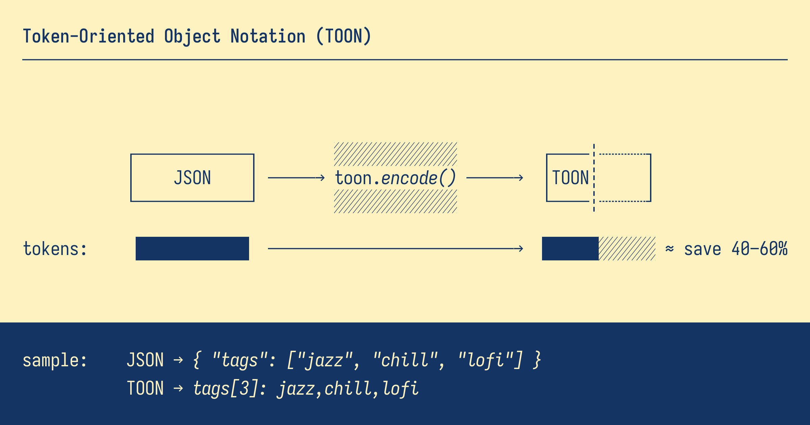

# TOON4J

Token-Oriented Object Notation (TOON) encoder and decoder for Java.

TOON is a compact, human-readable format designed for passing structured data to Large Language Models with significantly reduced token usage. This is the Java implementation port of the [original TOON specification](https://github.com/byjohann/toon).

## Features

- 💸 **Token-efficient:** typically 30–60% fewer tokens than JSON
- 🤿 **LLM-friendly guardrails:** explicit lengths and field lists help models validate output
- 🍱 **Minimal syntax:** removes redundant punctuation (braces, brackets, most quotes)
- 📐 **Indentation-based structure:** replaces braces with whitespace for better readability
- 🧺 **Tabular arrays:** declare keys once, then stream rows without repetition
- 🤖 **Automatic POJO serialization:** works with any Java object out of the box (optimized reflection)
- 🔄 **Full decode support:** parse TOON back into Java objects with strict/lenient modes
- 🪶 **Zero dependencies:** no external libraries required for encoding/decoding
- ✨ **Comprehensive type support:** Optional, Stream, primitive arrays, and all Java temporal types

## Installation

### Maven

```xml
<dependency>
    <groupId>im.arun</groupId>
    <artifactId>toon4j</artifactId>
    <version>0.0.1</version>
</dependency>
```

### Gradle

```gradle
implementation 'im.arun:toon4j:0.0.1'
```

## Quick Start

### Encoding

```java
import im.arun.toon4j.Toon;
import java.util.*;

public class Example {
    public static void main(String[] args) {
        Map<String, Object> data = Map.of(
            "user", Map.of(
                "id", 123,
                "name", "Ada",
                "tags", List.of("reading", "gaming"),
                "active", true
            )
        );

        String toon = Toon.encode(data);
        System.out.println(toon);
    }
}
```

Output:

```
user:
  id: 123
  name: Ada
  tags[2]: reading,gaming
  active: true
```

### Decoding

```java
String toon = """
    user:
      id: 123
      name: Ada
      tags[2]: reading,gaming
      active: true
    """;

Object data = Toon.decode(toon);
// Returns: {user={id=123, name=Ada, tags=[reading, gaming], active=true}}
```

## What's Included

✅ **Core TOON Encoding**
- Objects (nested)
- Arrays (inline, tabular, list formats)
- Empty containers
- Root arrays

✅ **Core TOON Decoding**
- Parse TOON format back to Java objects
- Support for all TOON features (objects, arrays, primitives)
- Strict mode with count validation
- Lenient mode for flexible parsing
- Custom delimiters (comma, tab, pipe)
- Escape sequence handling (\n, \t, \\, \")

✅ **Complete Type Support**
- All primitives (String, Boolean, Number)
- BigInteger and BigDecimal (with smart conversion)
- Optional<T> (automatic unwrapping)
- Stream<T> (automatic materialization)
- All primitive arrays (int[], double[], boolean[], etc.)
- All Java temporal types (LocalDate, OffsetDateTime, etc.)
- Collections (List, Set, Map)
- **POJOs (automatic serialization via optimized reflection)**

✅ **Flexible Configuration**
- Builder pattern
- Factory methods
- Preset configurations (compact, verbose)
- Custom delimiters (comma, tab, pipe)
- Optional length markers

✅ **Zero Dependencies**
- No external libraries required
- Pure Java implementation
- Optimized reflection for POJO conversion
- Cached accessors for performance

## Usage Examples

### Simple Objects

```java
Map<String, Object> obj = Map.of(
    "id", 123,
    "name", "Ada",
    "active", true
);

Toon.encode(obj);
```

Output:
```
id: 123
name: Ada
active: true
```

### POJOs (Automatic Serialization)

toon4j automatically serializes any Java object (POJO) using optimized reflection:

```java
public class User {
    private int id;
    private String name;
    private boolean active;

    public User(int id, String name, boolean active) {
        this.id = id;
        this.name = name;
        this.active = active;
    }

    // getters/setters...
}

// Automatic POJO serialization - no manual conversion needed!
User user = new User(123, "Ada", true);
String toon = Toon.encode(user);
```

Output:
```
id: 123
name: Ada
active: true
```

**Nested POJOs:**

```java
public class Address {
    private String city;
    private String country;
    // constructors, getters...
}

public class Person {
    private String name;
    private int age;
    private Address address;
    // constructors, getters...
}

Person person = new Person(
    "Alice",
    30,
    new Address("Paris", "France")
);

String toon = Toon.encode(person);
```

Output:
```
name: Alice
age: 30
address:
  city: Paris
  country: France
```

**Lists of POJOs:**

```java
public class Product {
    private String sku;
    private int quantity;
    private double price;
    // constructors, getters...
}

List<Product> products = List.of(
    new Product("A1", 2, 9.99),
    new Product("B2", 1, 14.50),
    new Product("C3", 5, 7.25)
);

String toon = Toon.encode(Map.of("products", products));
```

Output:
```
products[3]{sku,quantity,price}:
  A1,2,9.99
  B2,1,14.5
  C3,5,7.25
```

### Arrays of Objects (Tabular Format)

```java
List<Map<String, Object>> items = List.of(
    Map.of("sku", "A1", "qty", 2, "price", 9.99),
    Map.of("sku", "B2", "qty", 1, "price", 14.5)
);

Toon.encode(Map.of("items", items));
```

Output:
```
items[2]{sku,qty,price}:
  A1,2,9.99
  B2,1,14.5
```

### Custom Delimiters

```java
EncodeOptions options = EncodeOptions.builder()
    .delimiter(Delimiter.TAB)
    .build();

Toon.encode(data, options);
```

### Length Markers

```java
EncodeOptions options = EncodeOptions.builder()
    .lengthMarker(true)
    .build();

Toon.encode(data, options);
// Output: tags[#2]: reading,gaming
```

### Optional and Stream Support

```java
import java.util.Optional;
import java.util.stream.Stream;

Map<String, Object> data = Map.of(
    "presentValue", Optional.of("Hello"),
    "emptyValue", Optional.empty(),
    "numbers", Stream.of(1, 2, 3, 4, 5)
);

Toon.encode(data);
```

Output:
```
presentValue: Hello
emptyValue: null
numbers[5]: 1,2,3,4,5
```

## Decode Examples

### Simple Decoding

```java
String toon = """
    id: 123
    name: Ada
    active: true
    """;

Map<?, ?> data = (Map<?, ?>) Toon.decode(toon);
System.out.println(data.get("id"));     // 123
System.out.println(data.get("name"));   // Ada
System.out.println(data.get("active")); // true
```

### Decoding Arrays

```java
// Inline arrays
String toon1 = "tags[3]: reading,gaming,coding";
Map<?, ?> result1 = (Map<?, ?>) Toon.decode(toon1);
List<?> tags = (List<?>) result1.get("tags");
// ["reading", "gaming", "coding"]

// Tabular arrays
String toon2 = """
    items[2]{sku,qty}:
      A1,2
      B2,1
    """;
Map<?, ?> result2 = (Map<?, ?>) Toon.decode(toon2);
List<?> items = (List<?>) result2.get("items");
// [{sku=A1, qty=2}, {sku=B2, qty=1}]

// List arrays
String toon3 = """
    items[2]:
      - id: 1
        name: First
      - id: 2
        name: Second
    """;
Map<?, ?> result3 = (Map<?, ?>) Toon.decode(toon3);
// {items=[{id=1, name=First}, {id=2, name=Second}]}
```

### Decoding with Custom Delimiters

```java
// Pipe delimiter
String toon1 = "tags[3|]: a|b|c";
Map<?, ?> result = (Map<?, ?>) Toon.decode(toon1);

// Tab delimiter
String toon2 = "items[2\t]: x\ty";
Map<?, ?> result2 = (Map<?, ?>) Toon.decode(toon2);
```

### Lenient Mode

```java
// Strict mode (default) - throws error if count mismatch
String toon = "items[3]: a,b";  // Declared 3, but only 2 values
// Toon.decode(toon);  // Throws IllegalArgumentException

// Lenient mode - accepts count mismatch
DecodeOptions options = DecodeOptions.lenient();
Map<?, ?> result = (Map<?, ?>) Toon.decode(toon, options);
List<?> items = (List<?>) result.get("items");
// items.size() == 2 (lenient mode accepts it)
```

### Round-Trip Encoding/Decoding

```java
Map<String, Object> original = Map.of(
    "id", 123,
    "name", "Ada",
    "tags", List.of("reading", "gaming")
);

// Encode to TOON
String toon = Toon.encode(original);

// Decode back to Java
Map<?, ?> decoded = (Map<?, ?>) Toon.decode(toon);

// Values match
assert decoded.get("id").equals(123);
assert decoded.get("name").equals("Ada");
```

### Primitive Arrays

```java
int[] integers = {1, 2, 3, 4, 5};
double[] doubles = {1.5, 2.5, 3.5};
boolean[] booleans = {true, false, true};

Map<String, Object> data = Map.of(
    "ints", integers,
    "doubles", doubles,
    "bools", booleans
);

Toon.encode(data);
```

Output:
```
ints[5]: 1,2,3,4,5
doubles[3]: 1.5,2.5,3.5
bools[3]: true,false,true
```

### Temporal Types

```java
import java.time.*;

Map<String, Object> data = Map.of(
    "timestamp", OffsetDateTime.now(),
    "date", LocalDate.of(2025, 1, 15),
    "time", LocalTime.of(14, 30, 0),
    "instant", Instant.now()
);

Toon.encode(data);
```

## API Reference

### Encoding API

#### `Toon.encode(Object value)`

Encode a value to TOON format with default options.

**Parameters:**
- `value` - Any JSON-serializable value (Map, List, primitive, POJO)

**Returns:** TOON-formatted string

#### `Toon.encode(Object value, EncodeOptions options)`

Encode a value to TOON format with custom options.

**Parameters:**
- `value` - Any JSON-serializable value (Map, List, primitive, POJO)
- `options` - Encoding options

**Returns:** TOON-formatted string

### Decoding API

#### `Toon.decode(String input)`

Decode TOON format string to Java objects with default options (indent=2, strict=true).

**Parameters:**
- `input` - TOON-formatted string

**Returns:** Decoded value (Map, List, or primitive)

**Throws:** `IllegalArgumentException` if input is invalid or empty

#### `Toon.decode(String input, DecodeOptions options)`

Decode TOON format string to Java objects with custom options.

**Parameters:**
- `input` - TOON-formatted string
- `options` - Decoding options (indent size, strict validation)

**Returns:** Decoded value (Map, List, or primitive)

**Throws:** `IllegalArgumentException` if input is invalid or empty

### EncodeOptions

Configuration for encoding behavior. Multiple ways to create options:

#### Builder Pattern

```java
EncodeOptions options = EncodeOptions.builder()
    .indent(2)                    // Spaces per indentation level (default: 2)
    .delimiter(Delimiter.COMMA)   // Delimiter for arrays (default: COMMA)
    .lengthMarker(false)          // Prefix array lengths with # (default: false)
    .build();
```

#### Factory Methods

```java
// Custom indent
EncodeOptions.withIndent(4)

// Custom delimiter
EncodeOptions.withDelimiter(Delimiter.TAB)

// Enable length marker
EncodeOptions.withLengthMarker()
```

#### Preset Configurations

```java
// Default options (2 spaces, comma delimiter, no length marker)
EncodeOptions.DEFAULT

// Compact mode (tab delimiter for concise output)
EncodeOptions.compact()

// Verbose mode (tab delimiter + length marker for maximum clarity)
EncodeOptions.verbose()
```

**Delimiter Options:**
- `Delimiter.COMMA` - Use comma as delimiter (default)
- `Delimiter.TAB` - Use tab as delimiter
- `Delimiter.PIPE` - Use pipe as delimiter

### DecodeOptions

Configuration for decoding behavior.

#### Constructors

```java
// Default options (indent=2, strict=true)
new DecodeOptions()

// Custom indent
new DecodeOptions(4)

// Custom indent and strict mode
new DecodeOptions(4, true)
```

#### Factory Methods

```java
// Lenient mode (no strict validation)
DecodeOptions.lenient()

// Lenient mode with custom indent
DecodeOptions.lenient(4)
```

**Options:**
- `indent` (int) - Number of spaces per indentation level (default: 2)
- `strict` (boolean) - Enable strict validation (default: true)
  - **Strict mode:** Validates array counts, indentation rules, no tabs
  - **Lenient mode:** Flexible parsing, accepts count mismatches

## Type Conversions

| Java Type | TOON Output | Notes |
|---|---|---|
| **Primitives** | | |
| `null` | `null` | |
| `String` | Quoted if needed, unquoted otherwise | Minimal quoting based on content |
| `Boolean` | `true` or `false` | |
| `Integer`, `Long` | Decimal form | |
| `Double`, `Float` | Decimal form | Whole numbers converted to long |
| **Big Numbers** | | |
| `BigInteger` | Long if in range, string otherwise | Converted to Long when possible |
| `BigDecimal` | Long if whole number, double otherwise | Cleaner output for whole numbers |
| **Java 8+ Types** | | |
| `Optional<T>` | Unwrapped value or `null` | Automatically unwraps nested Optionals |
| `Stream<T>` | TOON array | Materialized to list |
| **Temporal Types** | | |
| `Date` | ISO instant string | |
| `Instant` | ISO instant string | |
| `ZonedDateTime` | ISO zoned date-time string | |
| `OffsetDateTime` | ISO offset date-time string | |
| `LocalDateTime` | ISO local date-time string | Preserves local time |
| `LocalDate` | ISO local date string | |
| `LocalTime` | ISO local time string | |
| **Primitive Arrays** | | |
| `int[]`, `long[]`, `short[]`, `byte[]` | Inline array | Efficient handling |
| `double[]`, `float[]` | Inline array | NaN/Infinity → null |
| `boolean[]` | Inline array | |
| `char[]` | Inline array | Converted to strings |
| `Object[]` | TOON array | Recursive encoding |
| **Collections** | | |
| `List`, `Set`, `Collection` | TOON array format | Tabular if uniform objects |
| `Map` | TOON object format | String keys required |
| **POJOs** | | |
| Custom Java objects | TOON object format | Automatic serialization via optimized reflection |
| Nested POJOs | Nested TOON objects | Full object graph support |
| **Special Values** | | |
| `NaN`, `Infinity` | `null` | Invalid floating point values |

## Building from Source

```bash
cd toon4j
mvn clean install
```

## Running Tests

```bash
mvn test
```

## License

MIT License - see the [original TOON repository](https://github.com/johannschopplich/toon) for details.

## Related Projects

- **Elixir:** [toon_ex](https://github.com/kentaro/toon_ex)
- **PHP:** [toon-php](https://github.com/HelgeSverre/toon-php)
- **Python:** [pytoon](https://github.com/bpradana/pytoon)
    - [python-toon](https://github.com/xaviviro/python-toon)
    - [toon-python](https://gitlab.com/KanTakahiro/toon-python)
- **Ruby:** [toon-ruby](https://github.com/andrepcg/toon-ruby)
- **.NET:** [toon.NET](https://github.com/ghost1face/toon.NET)
- **Swift:** [TOONEncoder](https://github.com/mattt/TOONEncoder)
- **Go:** [gotoon](https://github.com/alpkeskin/gotoon)

## Specification

For the complete TOON specification, see [SPEC.md](https://github.com/johannschopplich/toon/blob/main/SPEC.md) in the original repository.
